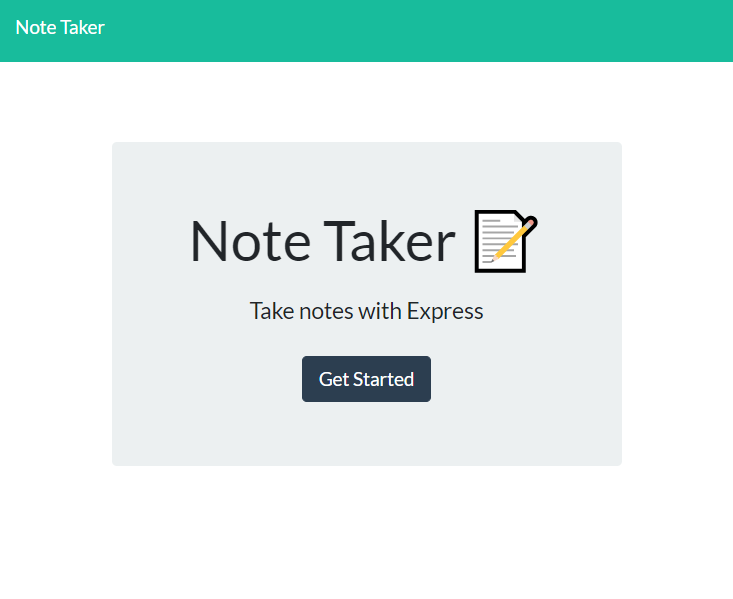
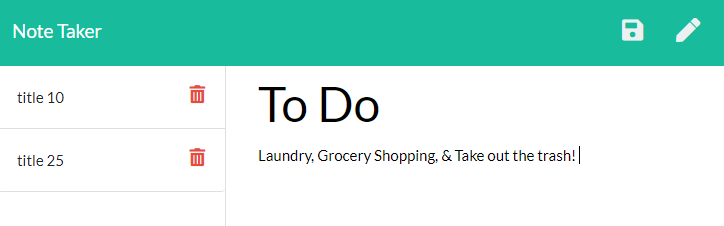

# The Note Taker with Express.js
  
   ## Table of Contents: 
   
* [Description](#Description)

* [Installation](#Installation)

* [Usage](#Usage)

* [License](#License)

* [Contributors](#Contributors)

* [Tests](#Tests)

* [Questions](#Questions)

   ## Description: 
   This Note Taker with Express is here to make your note taking simpler! You can type your to do list here and save it to come back to later. After you are done with it, just delete it, so simple! 
   ## Installation: 

   Installation Instructions

   npm install
   ## Usage: 

   Usage Information 

   Its so easy to use this application, just navigate to the url and click “Get Started”. Then type your note title and text in the appropriate places and save. Feel free to come back to you Notes later and they will be there for you. This app was made with JavaScript, HTML, CSS,  Bootstrap, Node.js, Express.js and Heroku. 

 Landing Page

  

  Note Page
  
 

   ## License
   
   
   ## Contributors: 

   Contribution Guidelines

   @janelle-deane
   ## Tests: 

   Test Instructions

   none
   ## Questions: 
   Feel free to reach out to me either on my github or email. 
   
   Github:
   https://github.com/janelle-deane/
   
   Email:
   janelle.m.deane@gmail.com